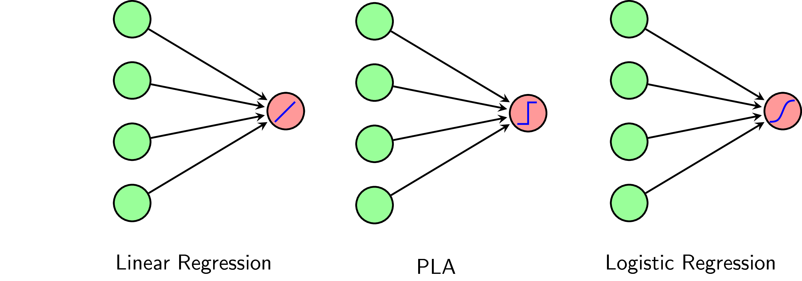
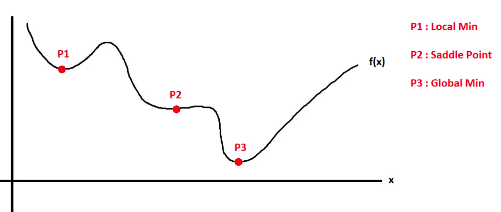
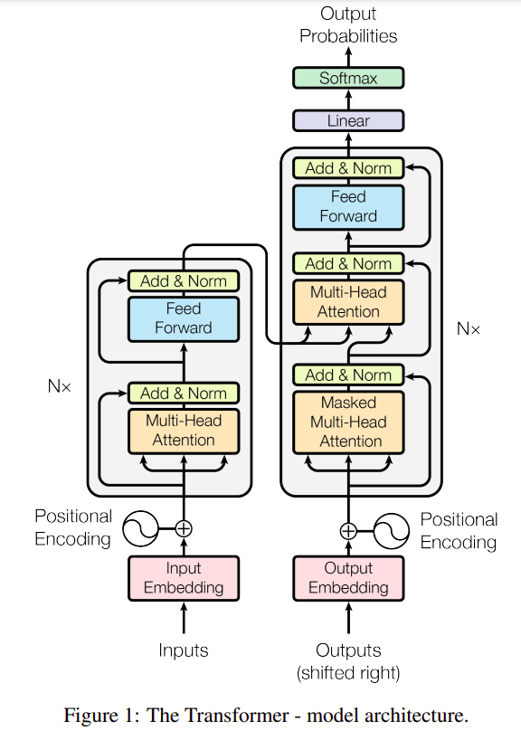
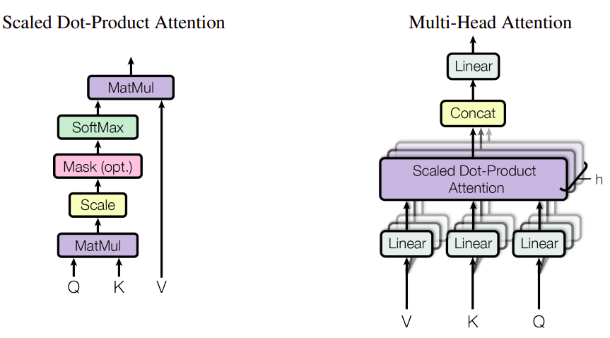
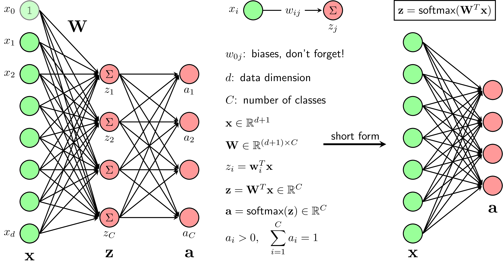
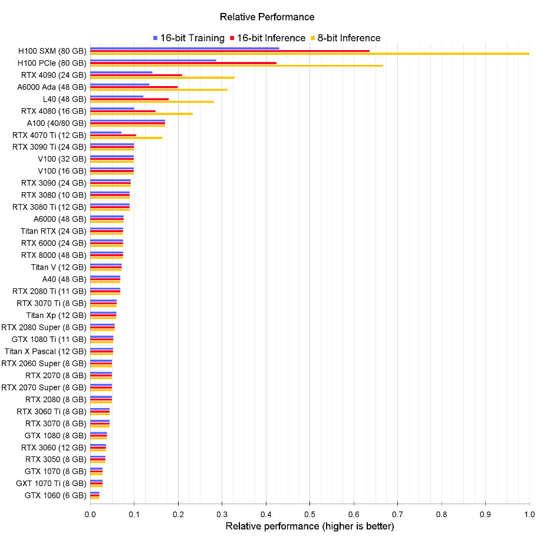
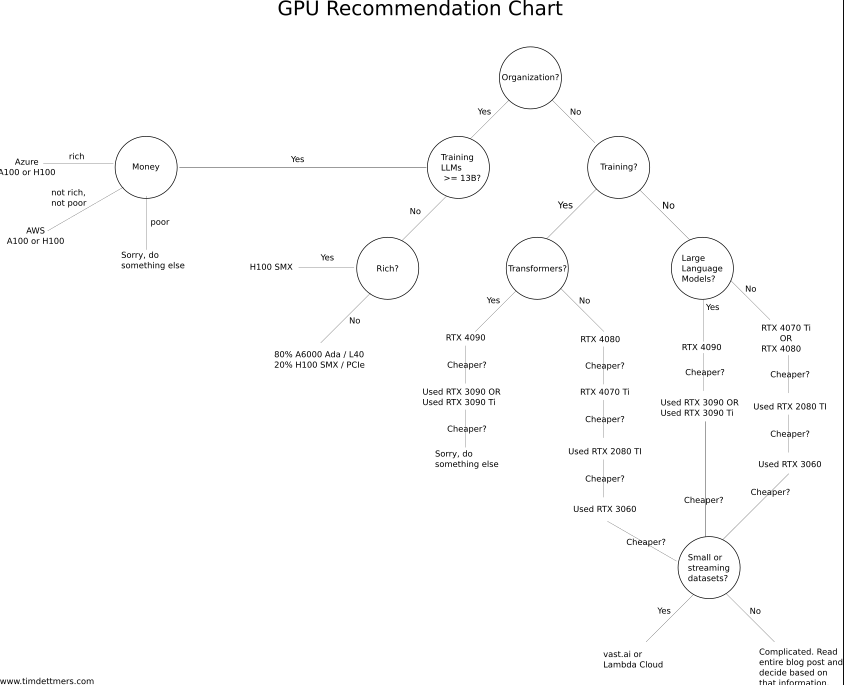

# Machine learning note

## Group based on learning style

- **Supervised learning**: pair of (data, label) is known
    - Classification
    - Regression
- **Unsupervised learning**: 
    - Clustering
    - Association
- **Semi-supervised learning**: only a portion of the data are labeled. 
- **Reinforcement learning** : 

## Algorithms group by similarity
- **Regression algorithms:**
    - [Linear regression](#linear-regression)
    - [Logistic regression](#logistic-regression)
    - Stepwise regression
- **Classification algorithm:** 
    - Linear classifier
    - Support vector machine (SVM)
    - Kernel SVM
    - Sparse representation-based classification (SRC)

- **Instance-based algorithm:**
    - k-nearest neighbors (kNN):
    - Learning Vector Quantization (LVQ)

- **Regularization algorithm:**
    - Ridge regression
    - Least absolute shrinkage and selection operator (LASSO)
    - Least-Angle Regression (LARS)
- **Bayesian algorithm:**
    - Naive Bayes
    - Gaussian Naive Bayes
- **Clustering algorithm:** 
    - k-means clustering
    - k-medians 
    - Expectation maximization (EM)
- **Dimensionality reduction algorithms:** 
    - [Principal component analysis](#principal-component-analysis) (PCA)
    - Linear discriminant analysis (LDA)
- **Ensemble algorithm:**
    - Boosting 
    - Adaboost
    - Random forest
- **Deep learning algorithms:**
    - Perceptron
    - [Softmax regression](#softmax-regression)
    - Multi-layer Perceptron    
    - Back-propagation

## Linear regression
$y$ (real value of outcome) and $\hat{y}$ (prediction value of outcome) are scalars.

$\bar{x} = [1, x_1, x_2, ..., x_N]$ is a row vector contains input information.

$w=[w_0, w_1, w_2, ..., w_N]^T$ is a column vector that need to be optimized, $w_0$ is called bias.

$$y \approx \bar{x}w = \hat{y}$$
or 
$$f(x) = w^Tx$$
- Loss function: 
$$L(w) = \frac{1}{2}\sum_{i=1}^N(y_i - \bar{x_i}w)^2 =\frac{1}{2}\ \| y-\bar{X}w \|_2^2 $$
(check out [norm](#norm) in Math)
- $\frac{dL}{dw} = \bar{X}^T(\bar{X}w-y) = 0 \Leftrightarrow \bar{X}^T\bar{X}w = \bar{X}^Ty \triangleq b$

- If $A = \bar{X}^T\bar{X}$ is invertible, $w = A^{-1}b$
> **_Question_** : Why don't we use absolute instead of square in loss function ?
> - Square function has a well-defined derivative everywhere, meanwhile absolute function has a non-differentiable point at 0.

> **_Question_** :  What if $A = \bar{X}^T\bar{X}$ is not invertible ? 
> - [Pseudo inverse](https://en.wikipedia.org/wiki/Moore%E2%80%93Penrose_inverse)

## Logistic regression
- assume from now $y_i\in\set{0,1}$ (binary classification).
- a process of modeling the probability of a discrete outcome given an input variable.  
$$f(x) = \theta(w^Tx)$$
where $\theta$ is [activation function](#activation-function) that outputs a number between [0,1].

- For training set $X = [x_1, x_2, ..., x_N] \in R^{d \times N}$ and $y=[y_1, y_2, y_3, ..., y_N]$, the objective is to find $w$ for $P(y|X;w)$ to maximize

- This is maximum likelihood estimation problem with $P(y|X;w)$ as a likelihood function: 

$$w=\underset{w}{argmax}(P(y|X;w))$$

- Let $z_i=\theta(w^Tx_i)$ then:
$$P(y_i|x_i;w) = z_i^{y_i}(1-z_i)^{1-y_i}$$

- BCELoss function (build from likelihood function): 
$$J(w) = -log(P(y|X;w))$$
$$=-\sum_{i=1}^N(y_ilog(z_i)+(1-y_i)log(1-z_i))$$
- Derivative with regards to $w$: 
    $$\frac{dz_i}{dw} = (z_i-y_i)x_i$$
> **_Question_** : Why use MSE for Linear regression and BCE for Logistic (not the other way around)?
>    - Due to assumption mismatch (MSE assumes Gaussian prior, while logistic’s data from Bernoulli).
>    - MSE leads to non-convex function, BCE leads to convex function. A convex loss function has only one global minimum and no local minima, making it easier to solve with a simpler optimization algorithm. However, a non-convex loss function has both local and global minima and requires an advanced optimization algorithm to find the global minimum.
>    - MSE does not penalize misclassification enough (e.g, if truth is 1 and prediction is 0, then MSE is 1 while BCE is inf)
> - Assumption of Probability Estimates: BCE loss assumes that the model's output represents probabilities. In classification problems, these probabilities can be interpreted as the likelihood of belonging to a particular class. In linear regression, the model's output does not represent probabilities, but rather the estimated continuous values of the dependent variable.
- Update formula following [SGD](#stochastic-gradient-descent):
    $$w = w + \eta(z_i-y_i)x_i $$
- Property: 
    - boundary created by logistic regression is a hyperplane $w^Tx$. Therefore, this model only works for data with 2 classes are almost linearly separable.

## Softmax regression
- more general algorithm than logistic regression to deal with multi-class labels. 

## Gradient descent
- Gradient points in the direction of the steepest increase in the loss

$$\theta = \theta - \eta\nabla_{\theta}J(\theta)$$

- **Key idea**: update the parameters in the opposite direction of the gradient (derivative) of the loss function with respect to those parameters. 

> **_Question_** :  What is gradient descent ? 
> - Gradient descent is an optimization algorithm to minimize the loss function by updating the model's parameters 
> - The learning rate is a hyperparameter that determines the size of the steps taken during the parameter updates.

### Batch Gradient Descent
- computes the gradient using the whole dataset

### Stochastic Gradient Descent
    
- picks a random instance in the training set at every step and computes the gradients based only on that single instance. 
    $$\theta = \theta - \eta\nabla_{\theta}J(\theta;x_i;y_i)$$
    > **_Question_** : What is advantage and disadvantage of SGD ? 
    > - Advantage: 
        - faster since it has little data to manipulate at every iteration $\rightarrow$ make it possible to train on a huge training sets. 
        - Due to its stochastic (i.e., random) nature, is good to escape from local optimai and has a better chance of finding the global minimum than Batch Gradient descent 
    > - Disadvantage: randomness means that the algorithm can never settle at the minimum and continue to bounce around
        - one solution is gradually reduce the learning rate.
### Mini-batch Gradient Descent
- number of picked instances > 1 (but still a lot fewer than $N$)

### Stopping Criteria
> **_Question_** : When do we know the algorithm is converged and should stop ? 
- In practice, there are a few number of ways.
    - predetermined maximum number of iterations. $\rightarrow$ can stop too soon
    - stop when the norm of the gradient is below some threshold
    $$\nabla_{\theta}J(w) < \epsilon$$
    - stop when the improvement drops below a threshold $\rightarrow$ might stuck in "_saddle points_"

Saddle points            | 
:-------------------------:

### Gradient descent with momentum 
- It cares about what previous gradients were: 
    $$m \leftarrow \beta m + \eta\nabla_{\theta}J(\theta)$$
    - to simulate some sort of friction mechanism and prevent the momentum from growing too large, the algorithm introduces a new hyperparameter $\beta$, called the momentum, which must be set between 0 (high friction) and 1(no friction). A typical momentum value is 0.9.
    $$\theta \leftarrow \theta - m$$

## Principal Component Analysis (PCA)
- A dimensionality reduction algorithm : with input is $x\in R^D$ and the output is $z \in R^{K}$ with $K < D$

## Transformer

### Attention

### Positional encoding
# Math
Some math knowledge needed about Linear algebra, Probability, Optimization, Discrete math, ... necessary for understanding of machine learning.

## Linear algebra
### Singular value decomposition (SVD) 

## Probability theory   
### Probability distribution
#### Binomal distribution
#### Bernoulli Distribution
#### Uniform Distribution
#### Normal or Gaussian Distribution
#### Exponential Distribution
#### Poisson Distribution
### KL-divergence

## Norm

## Activation function
### Sigmoid
$$\sigma(x) = \frac{1}{e^{-x} +1}$$
- specially, $\sigma^{'}(x) = \sigma(x)(1-\sigma(x))$

### Tanh
$$\tanh(x) = \frac{e^x-e^{-x}}{e^x+e^{-x}}$$
- specially, $\tanh(x) = 2\sigma(2x)-1$

### Softmax 
- for each input $x$, $a_i$ is the probability for $x$ to belong to class $i$: $a_i > 0$ and $\sum a_i = 1$
$$z_i = w_i^Tx$$
$$a_i = \frac{e^{z_i}}{\sum^{C}_{j=1} e^{z_j}}$$

- more stable version of softmax to prevent overflow when one of $z_i$ becomes to large.
$$a_i = \frac{e^{z_i-max(z_i)}}{\sum^{C}_{j=1} e^{z_j-max(z_i)}}$$

### Relu
$$\sigma(x) = \frac{x+|x|}{2} = max(x, 0)$$
> **_Question_** : What are the advantages of _ReLU_ over _sigmoid_ function in deep neural networks?
>    - Two additional major benefits of ReLUs are sparsity and a reduced likelihood of vanishing gradient.
>    - When $x>0$, the gradient has a constant value. In contrast, the gradient of sigmoids becomes increasingly small as the absolute value of $x$ increases.
>    - The constant gradient of ReLUs results in faster learning.
>    - Sparsity arises when $x \leq 0$. Sigmoids on the other hand are always likely to generate some non-zero value resulting in dense representations.

### Leaky Relu

- It is a type of activation function based on a ReLU, but it has a small slope for negative values instead of a flat slope. The slope coefficient is determined before training, i.e. it is not learnt during training. 

Leaky ReLU            | 
:-------------------------:

> **_Question_** : why _Leaky ReLU_ over _ReLU_?
>    - ReLU can suffer from the “dying ReLU” problem, where a neuron with a negative bias may never activate, resulting in a “dead” neuron. To avoid this, variants of ReLU have been proposed, such as leaky ReLU, exponential ReLU, and others
## Loss function
### Cross entropy:
- Cross entropy between two [discrete probability distributions](https://en.wikipedia.org/wiki/Probability_distribution#Discrete_probability_distribution) $p, q$ :
    $$H(p,q) = -\sum_{i=1}^{C} p_ilog(q_i)$$
### Triplet loss: 
- Teach model how to recognize the similarity or difference between items.
- It uses groups of three items (called triplets) : which consist of an _anchor item_, a _similar item_ (positive), and a _dissimilar item_ (negative). 
- The goal is to make the model understand that the anchor is closer to the positive than the negative item
- This scenario uses triplet loss to learn embeddings for every face. Faces from the same individual should be close together again and form well-separated clusters in the embedding space.
$$L(A, P, N) = max(||f(A)-f(P)||^2 - ||f(A)-f(N)||^2 + \alpha, 0)$$
where $f$ is the neural network, anchor input A, positive input P and negative input N; $\alpha$ is a margin threshold between positive and negative pairs.
- To produce triplets as input for each batch, there are two different approaches:
    - Offline triplet mining: Produce triplets offline, for example, at the beginning of each epoch.
    - Online triplet mining: Compute useful triplets on the fly on each batch of inputs.
- For online triplet mining, there are two strategies to calculate triplet loss on each batch:
    - Batch all: select all valid triplets and calculate the average triplet loss of the hard and semi-hard
triplets.
    - Batch hard: for each image, only select the positive farthest away and the negative nearest to the
anchor.  

## Metric
### F1-score
- metric used to evaluate the performance of a classification algorithm, (usually binary)
- Notation:  
    - TP : true positives
    - FP : false positives
    - FN : false negatives 
    - FP : false negatives
- Precision = $\frac{TP}{TP + FP}$
    - measures the accuracy of the positive predictions made by the model
- Recall = $\frac{TP}{TP + FN}$
    - measures the ability of the model to correctly identify all relevant instances
- F1-score = 2 * (Precision * Recall) / (Precision + Recall)
        = $\frac{2TP}{2TP+FP+FN}$
### L1-distance 
$$d_1(I_1,I_2) = \sum_p|I_1^p - I_2^p|$$
### L2 (Euclidean) distance
$$d_2(I_1,I_2) = \sqrt{\sum_p(I_1^p - I_2^p)^2}$$

# GPU
- read this [timdettmers's blog](https://timdettmers.com/) 
    
    
    

## Reference 
1. [Machine learning co ban](https://machinelearningcoban.com/2016/12/27/categories/)
2. [A tour of ML algorithms](https://machinelearningmastery.com/a-tour-of-machine-learning-algorithms/)
3. [Aurélien Géron - Hands-On Machine Learning with Scikit-Learn, Keras, and TensorFlow_ Concepts, Tools, and Techniques to Build Intelligent Systems](https://www.oreilly.com/library/view/hands-on-machine-learning/9781492032632/)

