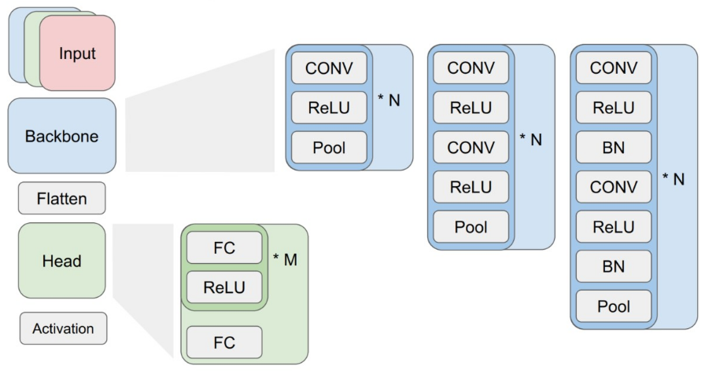
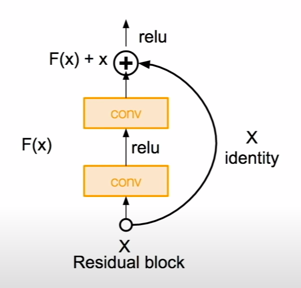
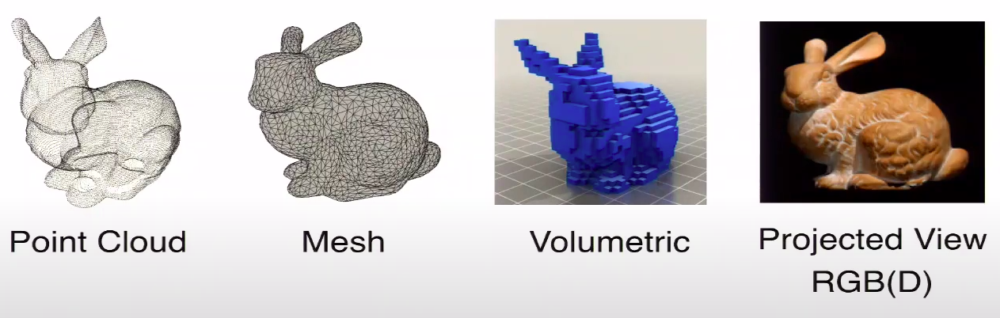
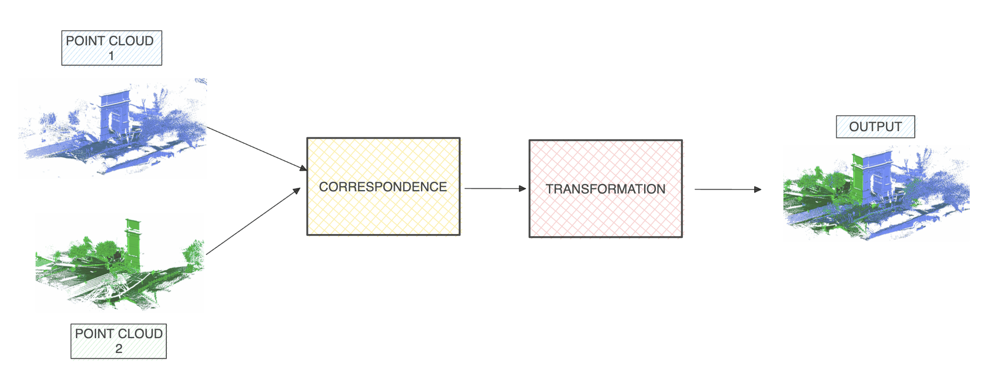
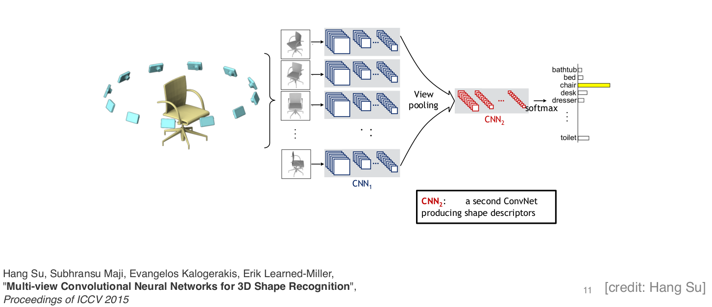

# Deep learning for computer vision
## Table of contents
- [`CNN`](#convolution-neural-network-cnn)
- [`GAN`](#generative-adversarial-networks-simple-gan)
- [`Diffusion model`](#diffusion-model)
- [`3D graphic concepts`](#3d-graphic)
- [`3D deep learning`](#3d-deep-learning)

## Convolution Neural network (CNN)
[reference](https://cs231n.github.io/convolutional-networks/)



### Pooling layer
- Common types: Max Pooling, Average Pooling
> **_Question_** : Why pooling layer is needed ? 
> - Reduce the size (spatial dimensions) of feature map
> - Increase receptive field : allowing them to capture more global features. 
> - Creating a level of invariance to small translations
### Receptive Field
- The input size of a kernel (prev layer or original input)
- Small RF misses important info, big RF cannot capture locality (overfit).
> _**Question**_ : Why use smaller filters ? 
> - Stack of three 3x3 conv (stride 1) layers have the same effective receptive field as one 7x7 conv layer.
> - But deeper, more non-linearities
> - And fewer parameters: 3*(3^2C^2) vs 7^2C^2 
### Stride
- How many pixels/features to move to get the next receptive field $\rightarrow$ dimension reduction.
### Padding
- Zero padding
- Valid padding
- Same padding 
- Formula:  $$\frac{W-F+2P}{S}+1$$
    - Input volume size ($W$)
    - The receptive field size of the Conv Layer neurons ($F$)
    - The stride with which they are applied ($S$), - The amount of zero padding used ($P$) on the border. 

### Case study: ResNet
- very deep networks using residual connections 



> _**Question**_ : Why residual connections (skip connections) works ? 
> - Deeper models are harder to optmize
> - Use network layers to fit a residual mapping instead of directly trying to fit a desired underlying mapping
> - It is a way to solve the vanishing gradient problem. And therefore models could be built even deeper.

## Generative Adversarial Networks (Simple GAN)
[paper](https://arxiv.org/abs/1406.2661)
- simultaneously train two models: a generative model G that captures the data distribution, and a discriminative model D that estimates the probability that a sample came from the training data rather than G
- The training procedure for G is to maximize the probability of D making a mistake. 
- The models are both multilayer perceptrons.
-  **_NOTATION_** : 
    - $G(z, \theta_g)$ : multilayer perceptron with parameters $\theta_g$, input noise $z$

    - $p_g$ : generator's distribution over data $x$


    - $D(x, \theta_g)$ : multilayer perceptron with parameters $\theta_g$ (output a single scalar). Represent the probability that $x$ came from that data rather than $p_g$

- Train $D$ to maximize probability of assigning the correct label to both training examples and samples from $G$.
    $$\frac{1}{m} \sum_{i=1}^{m}[logD(x^{i}) + log(1-D(G(z^{(i)})))]$$
- Train $G$ to minimize $log(1-D(G(z)))$
    $$\frac{1}{m} \sum_{i=1}^{m}log(1-D(G(z^{(i)})))$$
    - In practice, generator $G$ is trained to instead
        $$\underset{G}{max}\mathbb(E)_{z\sim p_z}(D(G(z)))$$
    - This new loss function leads to non-saturating gradients


## Diffusion model
[blog post](https://lilianweng.github.io/posts/2021-07-11-diffusion-models/)

## 3D Graphic
### 3D representations


- 3D has many representations:
    - multi-view RGB(D) images
    - [volumetric](#voxel)
    - polygonal mesh
    - [point cloud](#point-cloud)
    - primitive-based CAD models

### Voxel
- A volume representation is a specific kind of implicit representation that uses a regular
3D grid of discrete values called _voxels_
- Voxelization [point cloud](#point-cloud): converting the unstructured point data into a regular 3D grid of voxels
    - define voxel grids parameters : voxel size, dimensions of the grid in each axis
    - create an empty voxel grid
    - assign points to voxels
    - Voxelization Algorithm: 
        - Iterate through the points in the point cloud and distribute them into the voxel grid. 
        - There are different algorithms for this process, and one common approach is to use a simple rounding or floor operation to find the voxel indices for each point. For example:
        ```
        voxel_x = int((point_x - grid_origin_x) / voxel_size)
        voxel_y = int((point_y - grid_origin_y) / voxel_size)
        voxel_z = int((point_z - grid_origin_z) / voxel_size)
        ```
    - Handle Multiple Points in a Voxel : 
        - Common approaches include storing additional information (e.g., color or intensity) for each point in the voxel or using a simpler aggregation method like averaging. 

### Point cloud
- Point cloud is a discrete set of data points in space, each point has coordinates, and optionally, color, intensity, or normal information. 
- Point cloud is close to raw censor data. They are sampled from surfaces. 
- Point cloud is canonical : meaning that we can easily convert other 3D representations to point cloud or convert point cloud to others 

> _**Question**_ : What is the difference between point cloud and voxel ? 
> - A 3D raster is made of voxels. It divides 3-space into constant-sized little cubes. Each of these cubes has a value.
> - A point cloud is often derived by sampling. Each point represents an observation. Sometimes, a point cloud is turned into a surface by fitting triangles to the points in the form of an STL file
> - Pixels and voxels are rendering techniques. A point cloud is a sampling technique.
> - A point cloud is just a collection of points, while voxels - "3D pixels" - define location and a cube area. They seem to be pretty equivalent mathematically.

> _**Question**_ : What is the limitation of point cloud representation ?
> - Storage, processing, display requirements.
> - Lack of connectivity and topology information.
> - Difficulty in editing and transforming the data. Algorithms that operate directly on point clouds may require more time and resources compared to other representations, particularly for large-scale datasets.

> _**Question**_ : How to render 3D point cloud or shapes into 2D images ? 
> I don't know


## Point-set registration



- process of finding a spatial transformation (scaling, rotation, translation, ...) that aligns two point clouds. 

## Iterative closest point (ICP)
- see implmentation [here](./icp/)

## vSLAM
- Visual simultaneous localization and mapping (vSLAM), refers to the process of calculating the position and orientation of a camera with respect to its surroundings, while simultaneously mapping the environment.  
- Applications for vSLAM include augmented reality, robotics, and autonomous driving. 

## 3d deep learning
- a tutorial on 3d deep learning : [link](http://3ddl.stanford.edu/)
- [lecture's video](https://www.youtube.com/watch?v=vfl6ujyfrp4&t=858s). 
> _**Question**_ : Can we directly apply CNN on 3D data ? 
> - For irregular representation like point clound,  you cannot directly apply CNN 

### Deep learning on point cloud
- PointNet (paper) 
    - see implementation [here](./pointnet/)
    - An end-to-end learning for scattered, unordered point data. 
    - Unified framework for various task : Object classifcation, Object part segmentation,  Semantic sence parsing, ...


### Deep learning on multi-view representation (multiview stereo)



- Convert irregular (3D) to regular (images), similiar to human, combine surface information from multiple views
- Leverage pre-trained image-based CNNs
- Traditional approach: feature + linear classifer (MVCNN work in the figure)
- Issue: 
    - What viewpoints to select ? Where shall we place the camera in the scene ? 
    - What if the input is noisy and incomplete ? e.g point cloud
    - View-based network does not process invisible points
    - Slow to train
    - Aggregating view representations via max-pooling may lose information. 
- Stereo-based techniques: 
    - require matching features across images captured from slightly different viewing angles, 
    - use the triangulation principle to recover the 3D coordinates of the image pixels
- Shape-from-silhouette, or shapeby-space-carving, methods: 
    - require accurately segmented 2D silhouettes
    - require multiple images of- the same object captured by  well-calibrated cameras.


