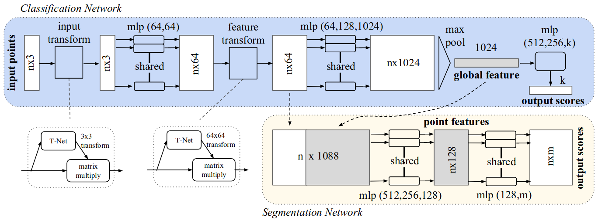
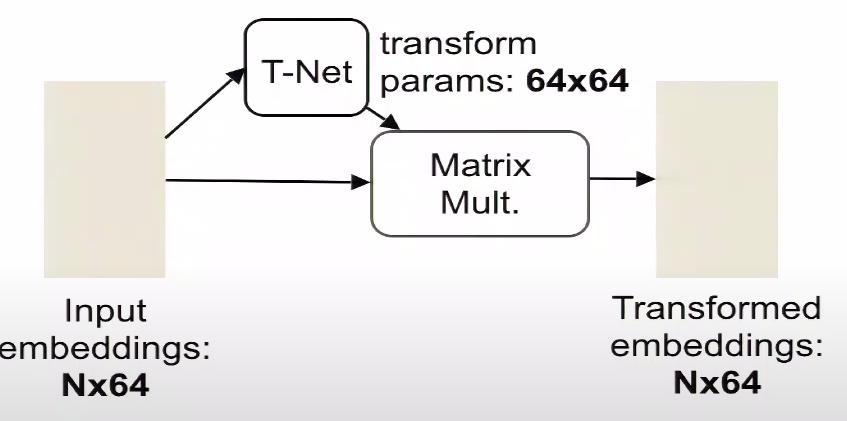
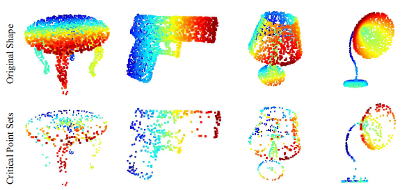

# PointNet 



- Implementation of pointnet : [paper](https://arxiv.org/pdf/1612.00593.pdf)
- An end-to-end learning for scattered, unordered point data. 
- Unified framework for various task : Object classifcation, Object part segmentation,  Semantic sence parsing, ...
- Current version of implementation in `main.py` is for object classification task on `ModelNet10` dataset. 

## Usage
- Download dataset
```
    bash script/download.sh
```
- Train the model
```
    python main.py
```

## Note
- Input is a subset of points from an Euclidean space with 3 main properties : 
    - **Unordered** : model that consumes 3D point sets need to be invariant to permutation
    - **Invariance under transformations** : no affine transformation (rotation, scale, translation) nor any reordering of points should have any effect on the output of the model
    - **Interaction among points** : model needs to be able to capture local structures from nearby points, and the combinatoric interactions among local structures.

<p align="center">

</p>

- __**Question**__ : How did PointNet address the 3 properties of point clouds : 
    - **Undordered** : neural network should be a symmetric function
        - transform each point independently and identically by conv1D (into high dimensional embedding space)
        - introducing MaxPooling to aggregate point features


    -  **Invariance under transformations** : align all input set to a canonical space before feature extraction. 
        - predict an affine transformation matrix by **T-net** and directly apply this transformation to the coordinates of input points.
        - add a regularization term to softmax loss to constraint feature transformation to be close to orthogonal matrix. 
            $$L_{reg} = \|I - AA^T\|^2_F$$
    - **Interaction among points** : segmentation network requires a combination of local and global point cloud feature vector by concatenating the global feature with each of the point features.     

<p align="center">

</p>

- __**Question**__ : Why is PointNet is so robust to missing data ? 
    - Critical points : Input point cloud that are contributing to the PointNet global feature 
    - It is learning to use a collection of critical points to summarize the shape, thus it is very robust to missing data.

