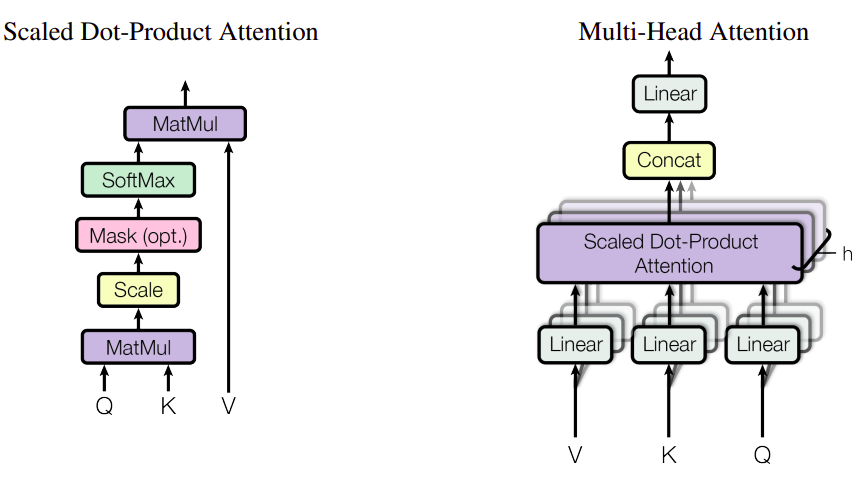

# NLP note
## Table of contents
- [`TFIDF`](#tf-idf-term-frequency-inverse-document-frequency)
- [`Transformer`](#transformer)

## TF-IDF (Term Frequency-Inverse Document Frequency)

$$TFIDF(t,d,D)=TF(t,d)×IDF(t,D)$$
- $TF(t,d)$ : term frequency of term t in document d, representing how often term t appears in document d. 
- $IDF(t, D)$ : inverse document frequency of term t in the entire document collection D. 
    $$IDF(t, D) = log(\frac{N}{DF(t, D)})$$    
    - $DF(t, D)$ : document frequency of term $t$. 

## Transformer
[reference](https://lilianweng.github.io/posts/2020-04-07-the-transformer-family/)

### Attention

### Positional encoding
